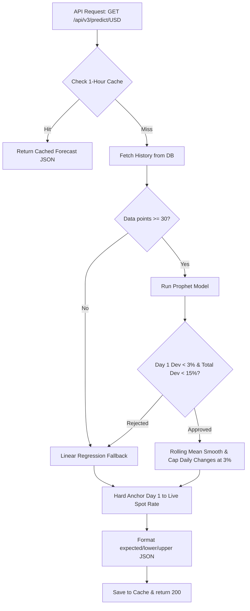
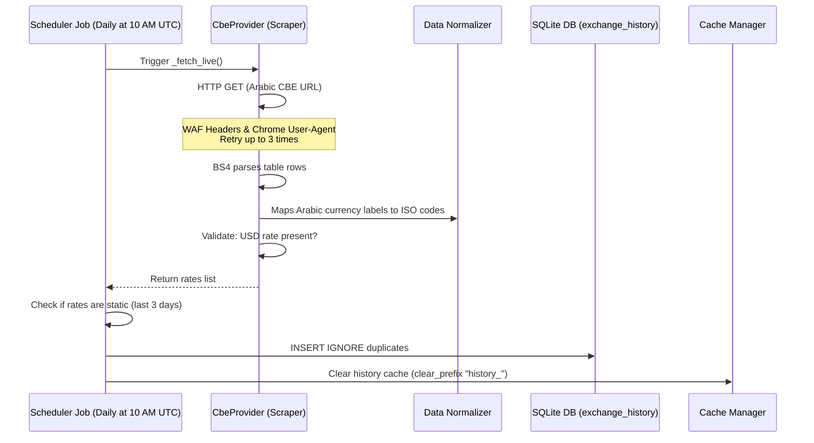
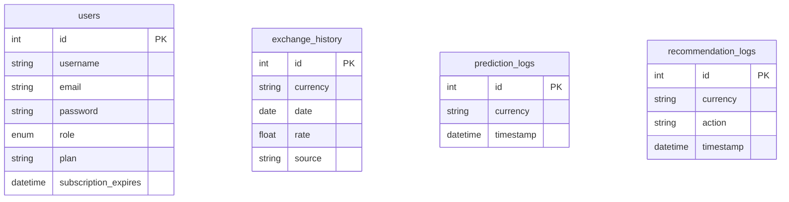

# Project Structure Guide

Welcome to the **OptiRate Project Structure & Architecture Guide**. This document outlines the system architecture, file structure, core subsystems, data pipelines, database models, and application startup sequences of the OptiRate platform.

---

## 1. Project Overview

**OptiRate** is a web-based financial intelligence platform that tracks and predicts foreign exchange rates, gold rates, and silver rates in Egypt. It serves as an analytics tool for individuals and investors to monitor inflation trends, compare bank rates, and receive AI-driven strategic advice on purchasing or selling assets.

### Main Goals
- **Real-Time Price Discovery**: Scraping current exchange rates directly from major Egyptian commercial banks and commodity marketplaces.
- **AI-Driven Forecasting**: Providing short-term and medium-term price projections using machine learning.
- **Strategic Advice**: Generating automated recommendations (Buy/Hold/Sell/Wait) based on expected price swings, confidence indices, and market volatility.
- **Subscription-Gated Features**: Restricting premium features (14-day forecasts, strategic recommendations) to paying users, managed via automatic role checks.

### Main Features
- **Egyptian Bank Rates Tracker**: Monitors 11 currencies (USD, EUR, GBP, SAR, AED, etc.) across multiple commercial banks.
- **Precious Metals Live Pricing**: Tracks gold (karats 24, 21, 18, coin, ounce) and silver.
- **Prophet AI Predictive Charts**: Renders visual forecasts using Facebook Prophet or linear regression fallback.
- **Interactive Strategic Form**: Analyzes financial actions based on currency, budget size, and intent.
- **Admin Control Panel**: Real-time stats dashboard and interactive user role management (Upgrade, Downgrade, Drop user).

---

## 2. Directory Structure

```text
optirate/
├── app.py                           # Main application factory & startup script
├── config.py                        # App and database configuration
├── extensions.py                    # Shared Flask extensions instances (DB, JWT, Bcrypt)
├── requirements.txt                 # Backend Python dependencies
├── .env                             # Environment configuration (secrets, dev settings)
├── PROJECT_STRUCTURE_GUIDE.md       # [THIS FILE] System architectural guide
├── UNUSED_FILES_REPORT.md           # Report mapping legacy or debug scripts
│
├── FRONTEND/                        # Frontend Single Page Application (SPA)
│   ├── index.html                   # Platform Landing / Main Frame page
│   ├── auth.html                    # Registration and Login form
│   ├── auth.js                      # Authenticates session and stores JWT
│   ├── auth.css                     # Auth portal layout styling
│   ├── dashboard.html               # Main user dashboard
│   ├── dashboard.js                 # Renders averages and triggers upgrade modal
│   ├── dashboard.css                # Dashboard container grid layouts
│   ├── bank-rates.html              # Commercial bank rate tables
│   ├── bank-rates.js                # Populates rate comparisons and filters
│   ├── bank-rates.css               # Bank table grid alignments
│   ├── metals.html                  # Precious metals commodity tracker page
│   ├── metals.js                    # Ingests live gold/silver prices and histories
│   ├── metals.css                   # Custom asset cards layout styling
│   ├── prediction.html              # AI predictive graphs panel
│   ├── prediction.js                # Integrates Chart.js for forecasting plots
│   ├── prediction.css               # Forecasting visual alignments
│   ├── recommendation.html          # Strategic buy/sell advice form
│   ├── recommendation.js            # Evaluates budget inputs and queries AI engines
│   ├── recommendation.css           # Strategic advice display formatting
│   ├── admin.html                   # Administration portal markup
│   ├── admin.js                     # CRUD user accounts and displays log stats
│   ├── api.js                       # Common Fetch helper wrapping JWT headers
│   ├── gated-features.js            # Frontend role limits decorator (adds blur/lock icons)
│   ├── news-service.js              # Pulls news headlines card rows
│   ├── payment.js                   # Handles interactive front/back credit card animations
│   ├── payment.css                  # CSS transitions for card flip animations
│   ├── style.css                    # Main design system styles
│   └── script.js                    # Base SPA router and navigation shell
│
├── models/                          # Database SQLAlchemy ORM Models
│   ├── __init__.py                  # Model registrations
│   ├── user.py                      # User accounts, roles, and subscriptions
│   ├── exchange_history.py          # Daily historical price points log
│   └── logs.py                      # Operation logs tracking predictions & recommendations
│
├── routes/                          # Flask Blueprints (API Controllers)
│   ├── __init__.py                  # Blueprint registration helper
│   ├── auth.py                      # Sign-up, Sign-in, Profile and JWT issuance
│   ├── v2.py                        # Read-only currency averages, metals, and news APIs
│   ├── v3.py                        # Premium AI forecasts, strategic advice, and mock pay
│   ├── admin.py                     # Administrative dashboard statistics and user CRUD
│   └── health.py                    # Simple health checks
│
└── services/                        # Business Logic Service Layers
    ├── cache/
    │   └── cache_manager.py         # Memory TTL caching module
    ├── core/
    │   ├── base_provider.py         # Parent abstract class for scraping providers
    │   ├── data_normalizer.py       # Standardizes JSON schemas from different sources
    │   └── response_builder.py      # Standardizes JSON response envelopes
    ├── engine/
    │   ├── currency_engine.py       # Manages bank rate lists and average rates
    │   ├── gold_engine.py           # Ingests gold spot rates and maps karats
    │   ├── silver_engine.py         # Ingests silver commodity rates
    │   ├── history_engine.py        # Logs historical CBE records to SQLite
    │   └── news_engine.py           # Aggregates news articles from multiple providers
    ├── providers/
    │   ├── cbe_provider.py          # Beautiful Soup parser for Central Bank of Egypt
    │   ├── dahabmasr_provider.py    # Scraping provider for DahabMasr Gold market
    │   ├── edahab_provider.py       # Scraping provider for E-Dahab metals rates
    │   ├── egrates_provider.py      # Scraping provider for commercial bank rates
    │   ├── google_news_provider.py  # Google RSS news feed ingestion
    │   └── news_api_provider.py     # NewsAPI client ingestion
    └── ai/
        ├── ai_service.py            # Orchestrator sorting forecasts and generating BUY/SELL signals
        └── prophet_model.py         # Configures Prophet/Linear models and applies constraints
```

---

## 3. Backend Architecture

This section details the primary backend modules, detailing their purpose, main components, and relationships.

### Main Flask Application Factory (`app.py`)
- **Purpose**: Creates the Flask application, loads configurations, binds database/JWT extensions, registers blueprints, configures error handlers, initializes the APScheduler background tasks, and registers global middlewares.
- **Main Components**:
  - `create_app()`: Application entry point factory.
  - `_seed_users(app)`: Injects default `admin`, `premium`, and `free` test credentials.
  - `subscription_guard()`: Global `@app.before_request` middleware. Automatically downgrades roles to `free` if the subscription expiration date has passed.
  - `BackgroundScheduler`: Triggers daily synchronizations.
- **Related Modules**: [extensions.py](file:///c:/Users/seifs/Desktop/optirate/extensions.py), [routes/auth.py](file:///c:/Users/seifs/Desktop/optirate/routes/auth.py), [services/engine/history_engine.py](file:///c:/Users/seifs/Desktop/optirate/services/engine/history_engine.py).

### Config Module (`config.py`)
- **Purpose**: Consumes environment variables via `.env` to build Flask configurations (DB paths, JWT secret keys, and CORS permissions).
- **Main Components**:
  - `Config`: Class declaring database settings and development flags.

### Database Models (`models/`)
- **[user.py](file:///c:/Users/seifs/Desktop/optirate/models/user.py)**: Manages credential hashing and subscription intervals for free, premium, and admin users.
- **[exchange_history.py](file:///c:/Users/seifs/Desktop/optirate/models/exchange_history.py)**: Holds unique daily rates per currency code. Uses SQLite indexes.
- **[logs.py](file:///c:/Users/seifs/Desktop/optirate/models/logs.py)**: Tracks forecasting requests (`PredictionLog`) and recommendation checks (`RecommendationLog`) to compile usage statistics for the admin dashboard.

### API Controllers (`routes/`)
- **[auth.py](file:///c:/Users/seifs/Desktop/optirate/routes/auth.py)**: Handles user registration (`/register`), login credentials check (`/login`), user profiles updates (`/update-profile`), and token identity lookup (`/me`).
- **[v2.py](file:///c:/Users/seifs/Desktop/optirate/routes/v2.py)**: Fetches currency lists (`/currencies`), gold karats (`/gold`), silver rates (`/silver`), news blocks (`/news`), and historical arrays (`/history/<currency>`).
- **[v3.py](file:///c:/Users/seifs/Desktop/optirate/routes/v3.py)**: Core premium controller. Wraps predictions (`/predict/<currency>`), strategic recommendation builders (`/recommend`), manual scraper trigger (`/ingest-history`), and mock payments (`/upgrade`).
- **[admin.py](file:///c:/Users/seifs/Desktop/optirate/routes/admin.py)**: Fetches dashboard metrics (`/stats`), updates user roles (`/users/<id>/role`), and drops users (`/users/<id>`).

---

## 4. Frontend Architecture

The frontend is built as a single-page application (SPA) using HTML, Vanilla CSS, and JavaScript.

| HTML View | Controller / Handler | Purpose | Primary Backend API Endpoints |
| :--- | :--- | :--- | :--- |
| `index.html` | `script.js` | Landing page containing navigation, SPA router, and session check. | `/api/me` |
| `auth.html` | `auth.js` | User login and registration views. | `/api/auth/register`, `/api/auth/login` |
| `dashboard.html` | `dashboard.js` | Renders user details, currency averages, and handles the Premium Upgrade modal. | `/api/protected`, `/api/v2/currencies?mode=average`, `/api/v3/upgrade` |
| `bank-rates.html` | `bank-rates.js` | Displays commercial bank tables for 11 currencies. | `/api/v2/currencies?mode=banks` |
| `metals.html` | `metals.js` | Displays precious metals pricing (gold karats, coins, ounce) and metal trends charts. | `/api/v2/gold`, `/api/v2/silver`, `/api/v2/metals/history` |
| `prediction.html` | `prediction.js` | Renders the Chart.js line graph of historical vs forecasted currency rates. | `/api/v2/history/<currency>`, `/api/v3/predict/<currency>` |
| `recommendation.html` | `recommendation.js` | Takes transaction parameters (budget, intent) and renders recommendations. | `/api/v3/recommend` |
| `admin.html` | `admin.js` | Displays platform usage stats and allows admins to change roles or delete users. | `/api/v1/admin/stats`, `/api/v1/admin/users`, `/api/v1/admin/users/<id>` |

---

## 5. Prediction System Documentation

The prediction system provides time-series forecasting using Facebook Prophet, falling back to Linear Regression under certain conditions.



### Key Technical Details
- **Prophet Wrapper Location**: [services/ai/prophet_model.py](file:///c:/Users/seifs/Desktop/optirate/services/ai/prophet_model.py)
- **AI Service Orchestrator**: [services/ai/ai_service.py](file:///c:/Users/seifs/Desktop/optirate/services/ai/ai_service.py)
- **Training Process**: The model is trained on-the-fly when a request is made. It uses historical rates fetched from the `exchange_history` table for the specified currency.
- **Outlier Filtering**: An Interquartile Range (IQR) filter is applied to historical data to remove price anomalies, protecting recent price movements (within the last 3 days).
- **Validation Constraints**:
  - **Day 1 Anchor**: Day 1 of the forecast is locked to the live bank spot rate to prevent the forecast from starting at a stale baseline.
  - **Day 1 Check**: If Prophet's unconstrained Day 1 forecast deviates from the live rate by more than 3%, the forecast is rejected, and the system falls back to Linear Regression.
  - **Daily Movement Cap**: Daily changes in predicted prices are capped at ±3% to prevent unrealistic spikes.
  - **Max Dev Check**: If the predicted price deviates from the live rate by more than 15% at any point, the entire forecast is rejected, triggering the linear fallback.
- **Confidence Intervals**: Prophet generates `yhat_lower` and `yhat_upper` values based on a 95% interval width. These bounds are adjusted by the same offset applied during spot rate anchoring and are constrained to be within 0.1% to 3.0% of the expected value.

---

## 6. Recommendation Engine Documentation

The recommendation engine generates BUY, SELL, HOLD, or WAIT signals for a specified transaction amount.

### Recommendation Workflow
1. **Fetch Forecast**: Retrieves the currency forecast from cache or runs the prediction engine.
2. **Calculate Trend**: Compares the final day's expected price to the live spot price to calculate the expected change percentage (`expected_change_pct`).
3. **Determine Volatility**: Calculates the standard deviation of recent prices (using the last 7 days of DB history, or live bank rates if DB data is stale).
   - **Low Volatility**: < 0.5% standard deviation.
   - **Medium Volatility**: 0.5% - 1.5% standard deviation.
   - **High Volatility**: > 1.5% standard deviation.
4. **Calculate Confidence Score**: Uses the spread of the forecast bounds on the final day:
   $$\text{Confidence} = \left(1 - \frac{\text{upper} - \text{lower}}{\text{expected}}\right) \times 100$$
   The score is capped between 0 and 100, and is reduced by 20 points if volatility is High.
5. **Evaluate Recommendation Rules**:
   - **Buy Intent**:
     - **BUY NOW**: Expected price increase $\ge 0.75\%$, volatility is NOT high, and confidence $\ge 65\%$.
     - **WAIT**: Expected price is decreasing, volatility is high, or the price increase is small.
   - **Sell Intent**:
     - **WAIT BEFORE SELLING**: Expected price increase $\ge 0.75\%$, volatility is NOT high, and confidence $\ge 65\%$ (suggesting the user wait for a higher price).
     - **SELL NOW**: Expected price decrease $\le -1.0\%$ (suggesting the user sell to avoid losses).
     - **HOLD**: The market is stable or expected changes are minimal.

---

## 7. Data Collection Pipeline



- **CBE Scraper Location**: [services/providers/cbe_provider.py](file:///c:/Users/seifs/Desktop/optirate/services/providers/cbe_provider.py)
- **Sync Orchestrator**: [services/engine/history_engine.py](file:///c:/Users/seifs/Desktop/optirate/services/engine/history_engine.py)
- **Scheduler Config**: [app.py](file:///c:/Users/seifs/Desktop/optirate/app.py)

---

## 8. Database Documentation

OptiRate uses an SQLite database (`instance/optirate.db`) managed by SQLAlchemy.



### Tables Schema & Purpose

#### `users` Table
- **Purpose**: Manages user accounts, login credentials, roles, and subscription states.
- **Indexes**: Unique index on `username` and `email`. Index on `plan`.

#### `exchange_history` Table
- **Purpose**: Stores historical rates for currencies and precious metals.
- **Constraints**: Unique constraint on `(currency, date)` to prevent duplicate entries.
- **Indexes**: Index on `currency` and `date`.

#### `prediction_logs` Table
- **Purpose**: Logs AI forecasting queries for usage analytics.
- **Indexes**: Index on `timestamp`.

#### `recommendation_logs` Table
- **Purpose**: Logs strategic recommendation queries.
- **Indexes**: Index on `timestamp`.

---

## 9. Application Startup Flow

### Backend Startup Sequence
1. **Initialize App**: Run `python app.py` (or `npm run dev` in development wrappers).
2. **Load Configurations**: Read settings from `config.py` and `.env`.
3. **Bind Extensions**: Initialize database sessions (`SQLAlchemy`) and JWT token configs.
4. **Register Blueprints**: Map controllers (`/api/auth`, `/api/v2`, `/api/v3`, `/api/v1/admin`) to Flask.
5. **Create & Seed Database**: Verify SQLite connection, run `db.create_all()` to generate tables, and create default users (`admin`, `premium`, `free`).
6. **Start Scheduler**: Initialize `BackgroundScheduler`. Queue the daily scraping sync (cron job at 10:00 AM UTC) and run one sync check immediately.
7. **Serve Port**: Listen on port `5000`.

### Frontend Startup Sequence
1. **Index Load**: The browser loads `index.html`.
2. **SPA Router Init**: `script.js` runs to register routes and handle back/forward navigation.
3. **Session Check**: Query the `/api/me` endpoint using any stored JWT.
   - If valid: Set user role states and show active dashboard controls.
   - If invalid: Revert to free guest state and display login actions.
4. **Render View**: Renders the view matching the current URL hash (e.g. `#dashboard` or `#prediction`).

### Scheduler Startup Sequence
1. **Initialize Scheduler**: Inside the application factory context, `BackgroundScheduler` is instantiated.
2. **Register Jobs**:
   - **Date Job**: Triggers the `run_daily_sync_job` once immediately at startup.
   - **Cron Job**: Schedules `run_daily_sync_job` to run daily at 10:00 AM UTC.
3. **Start Scheduler Threads**: `scheduler.start()` launches background threads to manage these tasks without blocking Flask request handling.
